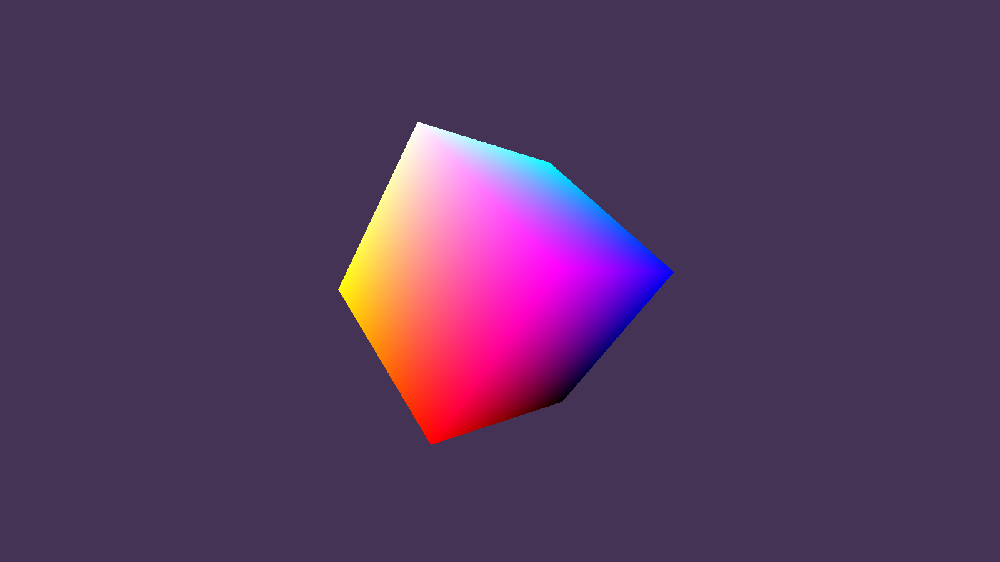

# hello_bgfx
GLFW + bgfx demo



## how to install dependencies

```shell
mkdir 3rdparty
cd 3rdparty
git clone https://github.com/bkaradzic/bx.git --depth 1
git clone https://github.com/bkaradzic/bimg.git --depth 1
git clone https://github.com/bkaradzic/bgfx.git --depth 1
git clone https://github.com/glfw/glfw.git --depth 1 --branch 3.3.8
cd bgfx
..\bx\tools\bin\windows\genie --with-examples --with-tools vs2022
msbuild .build\projects\vs2022\bgfx.sln -target:examples\example-01-cubes;tools\shaderc\shaderc -property:Configuration=Release -property:Platform="x64"
# If you need debug bgfx use
# msbuild .build\projects\vs2022\bgfx.sln -target:examples\example-01-cubes;tools\shaderc\shaderc -property:Configuration=Debug -property:Platform="x64"
```

## how to compile shaders

```shell
mkdir shaders/dx11
mkdir shaders/spirv
.\3rdparty\bgfx\.build\win64_vs2022\bin\shadercRelease.exe -f shaders/vs_cubes.sc -o shaders/dx11/vs_cubes.bin -i 3rdparty/bgfx/src --type vertex --platform windows -p vs_5_0 -O 3
.\3rdparty\bgfx\.build\win64_vs2022\bin\shadercRelease.exe -f shaders/fs_cubes.sc -o shaders/dx11/fs_cubes.bin -i 3rdparty/bgfx/src --type fragment --platform windows -p ps_5_0 -O 3
.\3rdparty\bgfx\.build\win64_vs2022\bin\shadercRelease.exe -f shaders/vs_cubes.sc -o shaders/spirv/vs_cubes.bin -i 3rdparty/bgfx/src --type vertex -p spirv
.\3rdparty\bgfx\.build\win64_vs2022\bin\shadercRelease.exe -f shaders/fs_cubes.sc -o shaders/spirv/fs_cubes.bin -i 3rdparty/bgfx/src --type fragment -p spirv
```
